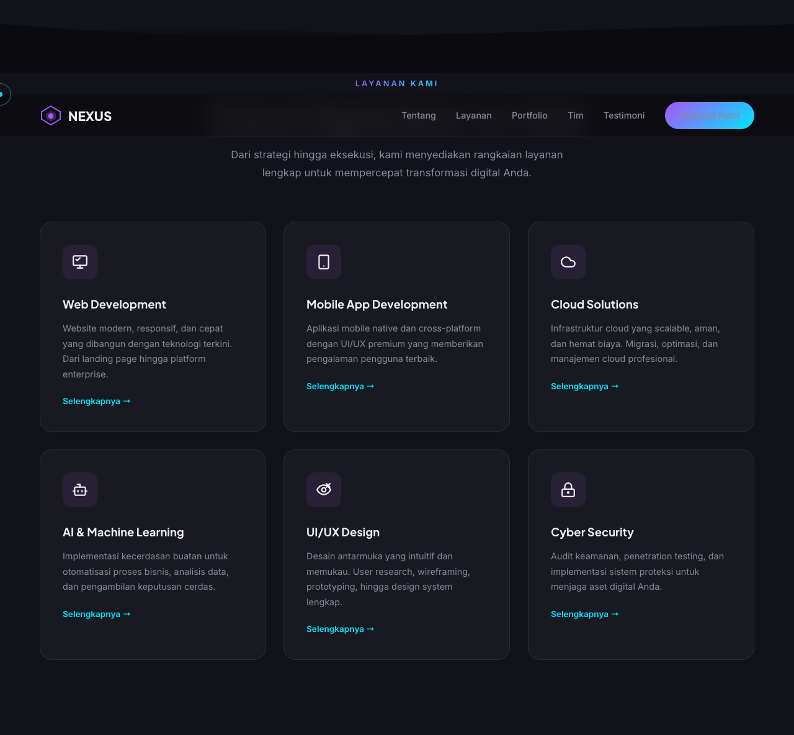
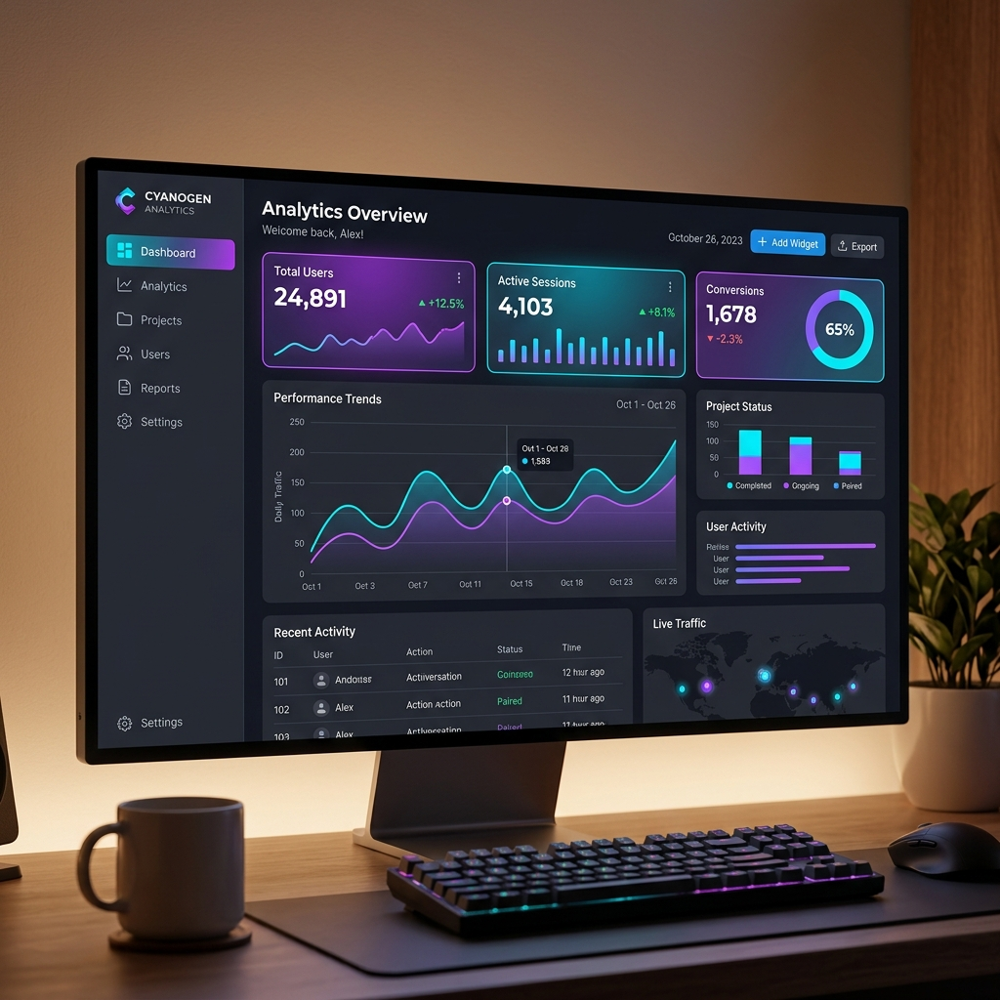
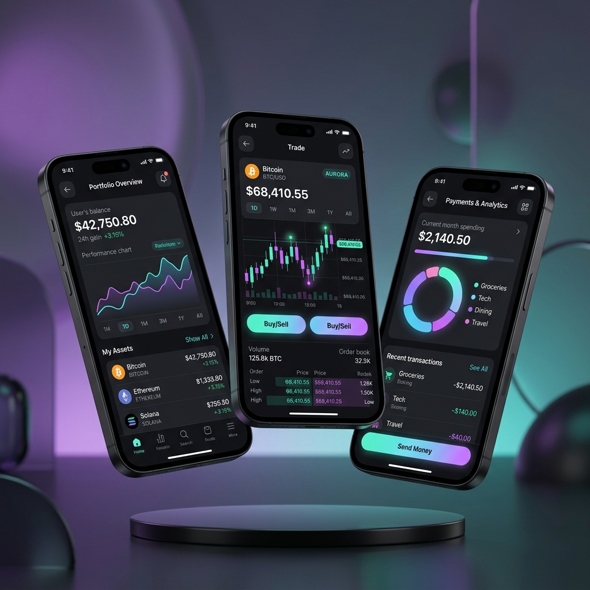
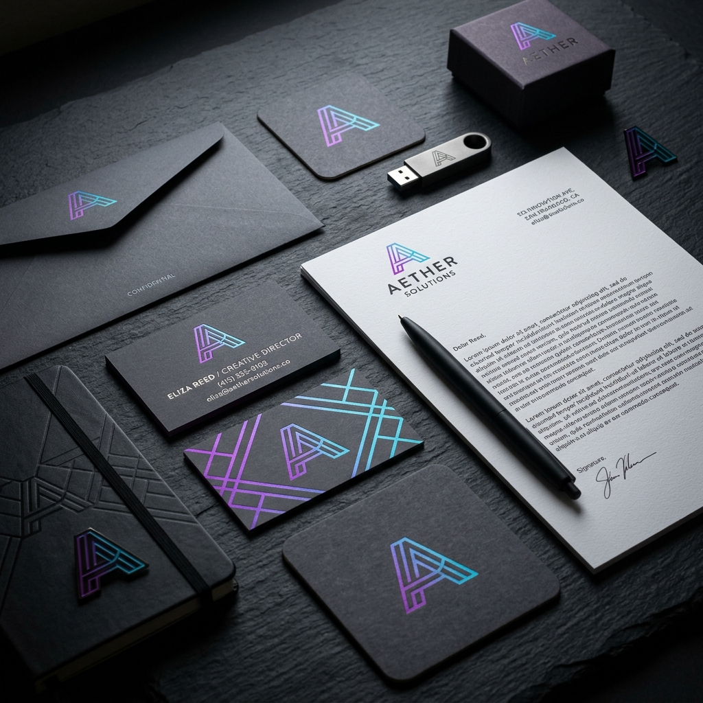
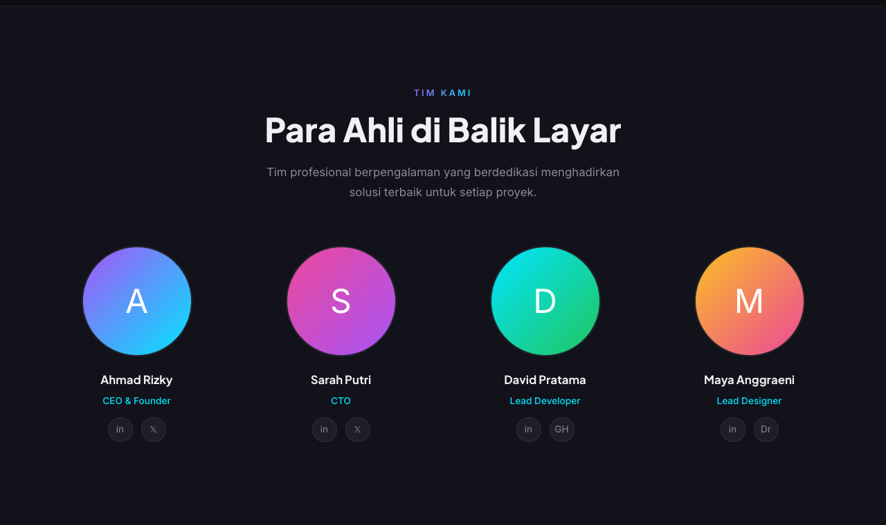
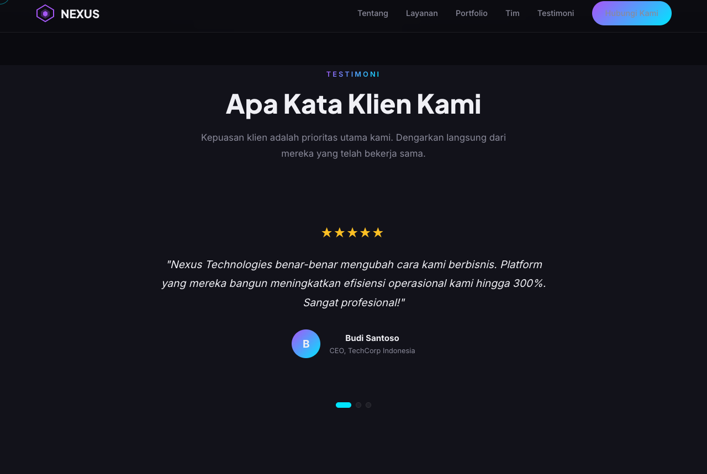

<div align="center">

<br/>

<svg width="64" height="64" viewBox="0 0 36 36" fill="none" xmlns="http://www.w3.org/2000/svg">
  <defs><linearGradient id="lg" x1="0" y1="0" x2="36" y2="36"><stop stop-color="#a855f7"/><stop offset="1" stop-color="#00e5ff"/></linearGradient></defs>
  <path d="M18 3L33 12v12L18 33 3 24V12L18 3z" stroke="url(#lg)" stroke-width="2" fill="none"/>
  <path d="M18 14l4 2.5v5L18 24l-4-2.5v-5L18 14z" fill="url(#lg)"/>
</svg>

# Nexus Technologies — Company Profile Website

**Website company profile premium dengan animasi interaktif, desain modern dark-mode, dan pengalaman pengguna kelas dunia.**

[](https://developer.mozilla.org/en-US/docs/Web/HTML)
[](https://developer.mozilla.org/en-US/docs/Web/CSS)
[](https://developer.mozilla.org/en-US/docs/Web/JavaScript)
[](LICENSE)

[🌐 Live Demo](#) · [🐛 Lapor Bug](../../issues) · [✨ Request Fitur](../../issues)

</div>

---

## 📋 Daftar Isi

- [Tentang Project](#-tentang-project)
- [Tampilan Website](#-tampilan-website)
- [Fitur & Kegunaan](#-fitur--kegunaan)
- [Teknologi yang Digunakan](#-teknologi-yang-digunakan)
- [Struktur Project](#-struktur-project)
- [Cara Menjalankan](#-cara-menjalankan)
- [Konfigurasi & Kustomisasi](#-konfigurasi--kustomisasi)
- [Performa & Optimisasi](#-performa--optimisasi)
- [Kompatibilitas Browser](#-kompatibilitas-browser)
- [Kontribusi](#-kontribusi)
- [Lisensi](#-lisensi)

---

## 🚀 Tentang Project

**Nexus Technologies Company Profile** adalah sebuah website company profile satu halaman (single-page) berkualitas premium yang dirancang untuk menampilkan layanan, portofolio, tim, dan informasi kontak sebuah perusahaan teknologi digital. Website ini dibangun menggunakan teknologi web standar (HTML, CSS, JavaScript murni) tanpa ketergantungan pada framework eksternal, sehingga ringan, cepat, dan mudah di-deploy di mana saja.

Website ini menggabungkan estetika desain modern dengan performa tinggi — setiap animasi dioptimasi menggunakan `requestAnimationFrame` dan `IntersectionObserver` agar tidak membebani CPU dan tetap berjalan mulus di perangkat apapun.

### Tujuan Project

- ✅ Menyajikan profil perusahaan secara profesional dan menarik
- ✅ Memberikan first impression yang kuat kepada calon klien
- ✅ Meningkatkan konversi melalui desain UI/UX yang terstruktur
- ✅ Mudah dikustomisasi sesuai identitas brand manapun
- ✅ Siap pakai tanpa instalasi framework yang rumit

---

## 📸 Tampilan Website

Berikut adalah beberapa tangkapan layar dari tampilan website Nexus Technologies untuk setiap bagian:

### Hero Section


### About Section


### Services Section


### Portfolio Section
<div style="display: flex; gap: 10px; justify-content: space-between;">
  
  
  
</div>

### Team Section


### Testimonials Section


| Bagian | Deskripsi |
|--------|-----------|
| Hero Section | Animasi particle, teks bertik otomatis, dan statistik perusahaan |
| Services | Kartu layanan dengan hover effect dan ikon SVG |
| Portfolio | Grid portofolio dengan filter kategori interaktif |
| Team | Profil tim dengan kartu animasi |
| Testimonials | Carousel testimoni klien dengan auto-slide |
| Contact | Form kontak dan informasi detail perusahaan |

---

## ✨ Fitur & Kegunaan

Berikut adalah penjelasan lengkap setiap fitur yang ada dalam website ini:

---

### 🖱️ 1. Custom Interactive Cursor

**Kegunaan:** Meningkatkan kesan premium dan interaktif bagi pengunjung desktop.

**Cara kerja:**
- Dua elemen cursor dibuat secara dinamis: **cursor dot** (titik kecil, mengikuti mouse secara instan) dan **cursor ring** (cincin besar, mengikuti dengan efek *lerp/linear interpolation* yang halus)
- Ketika mouse diarahkan ke elemen interaktif (tombol, link, kartu), cursor berubah ukuran dan warna secara otomatis
- Ketika mouse diarahkan ke input/textarea, cursor berubah menjadi mode teks
- Saat klik, cursor memberikan efek *click pulse*
- Di perangkat mobile/touch, custom cursor otomatis dinonaktifkan agar tidak mengganggu

**Elemen yang terpengaruh:** Semua `a`, `button`, `.service-card`, `.portfolio-card`, `.team-card`, `.testimonial-dots .dot`, `input`, `textarea`

---

### 🌊 2. Splash Reveal Effect on Scroll

**Kegunaan:** Memberikan transisi visual yang dramatis saat pengguna men-scroll ke section baru.

**Cara kerja:**
- Setiap kali section baru (Services, Portfolio, Team, Testimonials, Contact) memasuki viewport sebesar 60%, sebuah elemen splash animasi disisipkan ke dalam section tersebut
- Splash hanya dipicu satu kali per section (menggunakan `Set` untuk tracking)
- Setelah animasi selesai, elemen splash dihapus dari DOM untuk menjaga performa

---

### 🌊 3. Wave Divider Antar Section

**Kegunaan:** Memperhalus transisi visual antar section yang berbeda warna background.

**Cara kerja:**
- SVG wave (dua lapisan) disisipkan secara dinamis di bagian bawah section Services dan Testimonials
- Dua gelombang dengan jalur berbeda menciptakan efek kedalaman dan dimensi
- Seluruhnya dirender menggunakan inline SVG untuk performa optimal

---

### 🧭 4. Navbar Dinamis dengan Scroll Detection

**Kegunaan:** Menjaga navigasi selalu terlihat dan mudah diakses, sekaligus memberikan umpan balik visual saat pengguna scroll.

**Cara kerja:**
- Navbar transparan saat berada di posisi paling atas halaman
- Setelah scroll lebih dari 50px, navbar mendapat class `scrolled` yang mengaktifkan backdrop blur, background gelap semi-transparan, dan shadow
- Perubahan ini dibuat dengan CSS transition untuk tampilan yang halus

---

### 📱 5. Mobile Responsive Navigation (Hamburger Menu)

**Kegunaan:** Memastikan navigasi tetap berfungsi optimal di perangkat mobile.

**Cara kerja:**
- Di layar kecil (≤768px), nav-links disembunyikan dan digantikan tombol hamburger (3 garis)
- Klik tombol hamburger menganimasikan tiga garis menjadi ikon silang (X) dan membuka menu navigasi
- Ketika link di dalam menu diklik, menu otomatis tertutup
- Saat menu terbuka, scroll body dinonaktifkan (`overflow: hidden`) untuk mencegah scroll background

---

### 👁️ 6. Scroll Reveal Animation

**Kegunaan:** Elemen-elemen halaman muncul dengan animasi saat pertama kali masuk ke viewport, menciptakan pengalaman storytelling yang lebih baik.

**Cara kerja:**
- Menggunakan `IntersectionObserver` API (modern dan performa tinggi) sebagai metode utama
- Mendukung tiga jenis animasi reveal: `.reveal` (fade + naik), `.reveal-left` (slide dari kiri), `.reveal-right` (slide dari kanan)
- Setiap elemen hanya dianimasikan satu kali, lalu `unobserve` dipanggil untuk efisiensi memori
- Fallback menggunakan event scroll tradisional untuk browser lama yang tidak mendukung `IntersectionObserver`

---

### 🔢 7. Counter Animation (Animated Statistics)

**Kegunaan:** Menampilkan statistik perusahaan (jumlah proyek, klien puas, tahun pengalaman, jumlah tim) dengan animasi angka yang menarik perhatian.

**Cara kerja:**
- Counter diaktifkan saat section hero-stats memasuki viewport
- Menggunakan fungsi easing `easeOut` (cubic) untuk efek perlambatan yang natural di akhir animasi
- Angka dihitung menggunakan `requestAnimationFrame` untuk animasi 60fps yang halus
- Mendukung suffix kustom (e.g., `+`, `%`) melalui atribut `data-suffix`
- Counter hanya berjalan satu kali (dijaga dengan flag `counterDone`)

**Konfigurasi:** Atur nilai target dengan atribut `data-count` dan suffix dengan `data-suffix` pada elemen HTML

---

### 🔍 8. Portfolio Filter Interaktif

**Kegunaan:** Memungkinkan pengunjung memfilter portofolio berdasarkan kategori (Web App, Mobile App, Branding) tanpa refresh halaman.

**Cara kerja:**
- Tombol filter mencantumkan class `active` saat dipilih
- Kartu portofolio yang tidak sesuai kategori disembunyikan (`display: none`)
- Kartu yang sesuai dimunculkan dengan animasi fade + slide-up bertahap menggunakan `setTimeout` dengan delay berbeda per kartu (staggered animation)
- Filter "Semua" menampilkan seluruh kartu

---

### 💬 9. Testimonial Carousel

**Kegunaan:** Menampilkan testimoni klien secara bergantian tanpa memakan banyak ruang layar.

**Cara kerja:**
- Track testimoni digeser menggunakan CSS `transform: translateX()` untuk performa GPU-accelerated
- Navigasi melalui dot indicator yang bisa diklik
- Auto-slide berpindah ke testimoni berikutnya setiap 5 detik menggunakan `setInterval`
- Dot indicator aktif selalu sinkron dengan slide yang sedang ditampilkan

---

### ✨ 10. Particle Background Animation

**Kegunaan:** Menciptakan background hero yang hidup dan dinamis dengan partikel bergerak yang saling terhubung.

**Cara kerja:**
- Dirender di atas elemen `<canvas>` HTML5 untuk performa optimal
- Jumlah partikel disesuaikan secara otomatis dengan lebar layar (max 80 partikel) agar tidak terlalu berat di layar kecil
- Setiap partikel bergerak dengan kecepatan dan arah acak; jika keluar batas canvas, posisinya direset
- Partikel yang berdekatan (jarak < 120px) dihubungkan dengan garis semi-transparan
- Warna partikel bergantian antara cyan (`0,229,255`) dan purple (`168,85,247`) sesuai palet brand
- **Optimasi kritis:** Animasi dinonaktifkan secara otomatis menggunakan `IntersectionObserver` saat hero section tidak terlihat (pengguna scroll ke bawah), sehingga tidak membuang sumber daya CPU

---

### 🔤 11. Smooth Scroll Navigation

**Kegunaan:** Navigasi antar section terasa halus dan tidak tiba-tiba seperti jump default browser.

**Cara kerja:**
- Semua anchor link (`href="#..."`) ditangkap dengan `preventDefault()`
- Posisi target dihitung dengan memperhitungkan tinggi navbar tetap (offset 80px)
- Scroll menggunakan `window.scrollTo({ behavior: 'smooth' })` untuk pergerakan yang mulus

---

### 📬 12. Contact Form dengan Feedback Visual

**Kegunaan:** Memungkinkan pengunjung mengirim pesan inquiry secara langsung dari website.

**Cara kerja:**
- Validasi form bawaan HTML5 (`required`, `type="email"`)
- Saat form disubmit, tombol berubah teks menjadi "Terkirim! ✓" dan warnanya berubah ke hijau sebagai konfirmasi visual
- Setelah 3 detik, tombol dan form kembali ke kondisi semula (reset otomatis)
- Form siap dihubungkan ke backend atau layanan seperti Formspree, EmailJS, dll.

---

### ⌨️ 13. Typing Effect (Hero Section)

**Kegunaan:** Menampilkan berbagai kata kunci bisnis secara bergantian di hero section, menciptakan kesan dinamis dan menarik perhatian.

**Cara kerja:**
- Kata-kata yang ditampilkan: `Inovasi Digital`, `Solusi Teknologi`, `Transformasi Bisnis`, `Masa Depan`
- Animasi mengetik dengan kecepatan 100ms/karakter dan menghapus dengan 50ms/karakter
- Jeda selama 2 detik saat kata lengkap sebelum mulai menghapus
- Loop tak terbatas secara otomatis

---

### ⚡ 14. Performance Optimizations

**Kegunaan:** Memastikan website tetap responsif dan tidak *lag* meski banyak animasi berjalan bersamaan.

**Teknik yang digunakan:**
- **Throttle utility**: Membatasi frekuensi eksekusi handler scroll/resize
- **Unified scroll handler via rAF**: Semua callback scroll (navbar, counter, splash) digabung dalam satu `requestAnimationFrame` loop, bukan listener terpisah
- **Passive event listeners**: Semua scroll/touch listener menggunakan `{ passive: true }` agar browser tidak perlu menunggu callback sebelum scroll
- **IntersectionObserver**: Menggantikan scroll-based detection yang mahal dengan API native yang lebih efisien
- **Canvas particle pause**: Particle animation berhenti saat tidak terlihat
- **GPU-accelerated transforms**: Animasi menggunakan `translate3d` dan `transform` alih-alih `top/left` untuk memanfaatkan GPU

---

## 🛠️ Teknologi yang Digunakan

| Teknologi | Versi | Kegunaan |
|-----------|-------|---------|
| **HTML5** | Latest | Struktur semantic website |
| **CSS3** | Latest | Styling, animasi, layout (Flexbox & Grid) |
| **Vanilla JavaScript** | ES6+ | Interaktivitas dan animasi |
| **Canvas API** | HTML5 | Particle background animation |
| **IntersectionObserver API** | Web Standard | Scroll-triggered animations |
| **Lucide Icons** | Latest (CDN) | Ikon SVG via CDN |
| **CSS Custom Properties** | CSS3 | Design tokens dan theming |
| **CSS Backdrop Filter** | CSS3 | Glassmorphism effect pada navbar |

> ⚡ **Zero Framework** — Tidak membutuhkan npm, webpack, atau build tools apapun.

---

## 📁 Struktur Project

```
nexus-technologies/
│
├── 📄 index.html              # File utama HTML (single-page)
│
├── 📁 css/
│   └── 📄 style.css           # Semua styling: design system, komponen, animasi
│
├── 📁 js/
│   └── 📄 main.js             # Semua interaktivitas: animasi, cursor, partikel, dll.
│
├── 📁 assets/
│   └── 📁 images/
│       ├── 🖼️ about.png           # Gambar section "Tentang Kami"
│       ├── 🖼️ portfolio-web.png   # Gambar portofolio Web App
│       ├── 🖼️ portfolio-mobile.png # Gambar portofolio Mobile App
│       └── 🖼️ portfolio-branding.png # Gambar portofolio Branding
│
├── 📄 README.md               # Dokumentasi project (file ini)
├── 📄 .gitignore              # File/folder yang diabaikan git
└── 📄 LICENSE                 # Lisensi MIT
```

---

## 🚀 Cara Menjalankan

### Prasyarat

Tidak ada prasyarat khusus! Cukup browser modern (Chrome, Firefox, Safari, Edge).

### Metode 1: Buka Langsung

```bash
# Clone repository
git clone https://github.com/USERNAME/nexus-technologies.git

# Masuk ke folder project
cd nexus-technologies

# Buka index.html di browser
open index.html       # macOS
start index.html      # Windows
xdg-open index.html   # Linux
```

### Metode 2: Menggunakan Live Server (Rekomendasi untuk Development)

Jika menggunakan VS Code, install extension **Live Server** lalu klik kanan `index.html` → "Open with Live Server".

Atau menggunakan Python:

```bash
# Python 3
python -m http.server 8000

# Buka di browser: http://localhost:8000
```

Atau menggunakan Node.js:

```bash
# Install serve secara global
npm install -g serve

# Jalankan server
serve .

# Buka di browser: http://localhost:3000
```

### Metode 3: Deploy ke GitHub Pages

1. Push repository ke GitHub
2. Pergi ke **Settings → Pages**
3. Pilih **Source: Deploy from a branch**
4. Pilih branch `main` dan folder `/ (root)`
5. Klik **Save**
6. Website akan live di `https://USERNAME.github.io/nexus-technologies`

---

## ⚙️ Konfigurasi & Kustomisasi

### Mengubah Informasi Perusahaan

Edit bagian-bagian berikut di `index.html`:

```html
<!-- Nama Perusahaan (Navbar & Footer) -->
<span>NEXUS</span>

<!-- Tagline Hero -->
<h1 class="hero-title">Wujudkan<br>
  <span class="gradient-text" id="typed-text">Inovasi Digital</span>
  ...
</h1>

<!-- Informasi Kontak -->
<p>Jl. Inovasi Digital No. 88, Jakarta Selatan</p>
<p>hello@nexustech.id</p>
<p>+62 21 1234 5678</p>
```

### Mengubah Statistik Hero

```html
<!-- Ubah nilai data-count untuk angka target animasi counter -->
<span class="gradient-text" data-count="150" data-suffix="+">0</span>  <!-- 150+ Proyek -->
<span class="gradient-text" data-count="98" data-suffix="%">0</span>   <!-- 98% Klien Puas -->
<span class="gradient-text" data-count="10" data-suffix="+">0</span>   <!-- 10+ Tahun -->
<span class="gradient-text" data-count="25" data-suffix="">0</span>    <!-- 25 Tim Ahli -->
```

### Mengubah Warna Palet (Design Tokens)

Edit CSS Custom Properties di bagian `:root` dalam `css/style.css`:

```css
:root {
  --accent-purple: #a855f7;   /* Warna utama purple */
  --accent-cyan: #00e5ff;     /* Warna aksen cyan */
  --bg-primary: #0a0a0f;      /* Background utama (gelap) */
  --bg-secondary: #0f0f1a;    /* Background section alternatif */
  --text-primary: #f0f0ff;    /* Warna teks utama */
  --text-muted: #8888aa;      /* Warna teks sekunder */
}
```

### Mengubah Kata-kata Typing Effect

Edit array `words` di `js/main.js`:

```javascript
const words = ['Inovasi Digital', 'Solusi Teknologi', 'Transformasi Bisnis', 'Masa Depan'];
//             ↑ Tambah atau ubah kata-kata di sini
```

### Menambah Item Portfolio

Tambahkan kartu baru di section portfolio `index.html`:

```html
<div class="portfolio-card reveal" data-category="web">
  
  <div class="portfolio-overlay">
    <span class="tag">Web App</span>
    <h3>Nama Proyek</h3>
    <p>Deskripsi singkat proyek</p>
  </div>
</div>
```

**Kategori yang tersedia:** `web`, `mobile`, `branding`

### Menghubungkan Form Kontak ke Backend

Edit event handler form di `js/main.js`:

```javascript
form.addEventListener('submit', async (e) => {
  e.preventDefault();
  const data = new FormData(form);
  
  // Contoh integrasi dengan Formspree
  await fetch('https://formspree.io/f/YOUR_FORM_ID', {
    method: 'POST',
    body: data,
    headers: { 'Accept': 'application/json' }
  });
  
  // ... tampilkan feedback sukses
});
```

---

## ⚡ Performa & Optimisasi

Website ini dirancang dengan performa sebagai prioritas utama:

| Metrik | Target | Teknik |
|--------|--------|--------|
| **First Contentful Paint** | < 1.5s | Zero dependencies, inline SVG |
| **Time to Interactive** | < 2s | Deferred non-critical JS |
| **Layout Shift (CLS)** | < 0.1 | Dimensi gambar explisit |
| **Animasi** | 60fps | rAF + GPU transforms |
| **Scroll Performance** | Smooth | Passive listeners + throttle |

### Tips Optimisasi Tambahan

- Kompres gambar di folder `assets/images/` menggunakan [Squoosh](https://squoosh.app/) atau [TinyPNG](https://tinypng.com/)
- Gunakan format WebP untuk gambar portfolio
- Tambahkan atribut `loading="lazy"` pada gambar di bawah fold:
  ```html
  
  ```

---

## 🌐 Kompatibilitas Browser

| Browser | Versi Minimum | Status |
|---------|---------------|--------|
| Chrome | 80+ | ✅ Full Support |
| Firefox | 75+ | ✅ Full Support |
| Safari | 14+ | ✅ Full Support |
| Edge | 80+ | ✅ Full Support |
| Opera | 67+ | ✅ Full Support |
| IE | — | ❌ Tidak Didukung |

> **Catatan:** Custom cursor hanya aktif di perangkat non-touch (desktop). Di mobile/tablet, cursor otomatis dinonaktifkan.

---

## 🤝 Kontribusi

Kontribusi sangat disambut! Berikut langkah-langkahnya:

1. **Fork** repository ini
2. Buat branch fitur baru:
   ```bash
   git checkout -b feature/NamaFitur
   ```
3. Commit perubahan Anda:
   ```bash
   git commit -m 'feat: Tambah NamaFitur'
   ```
4. Push ke branch:
   ```bash
   git push origin feature/NamaFitur
   ```
5. Buka **Pull Request**

### Pedoman Commit Message

Gunakan format [Conventional Commits](https://www.conventionalcommits.org/):

```
feat: tambah fitur baru
fix: perbaikan bug
docs: update dokumentasi
style: perubahan styling
refactor: refactor kode
perf: peningkatan performa
```

---

## 📝 Lisensi

Didistribusikan di bawah **Lisensi MIT**. Lihat file [LICENSE](LICENSE) untuk informasi lebih lanjut.

---


<div align="center">

**Dibuat dengan ❤️ oleh Tim Nexus Technologies**

⭐ Jika project ini membantu, jangan lupa beri bintang! ⭐

</div>
